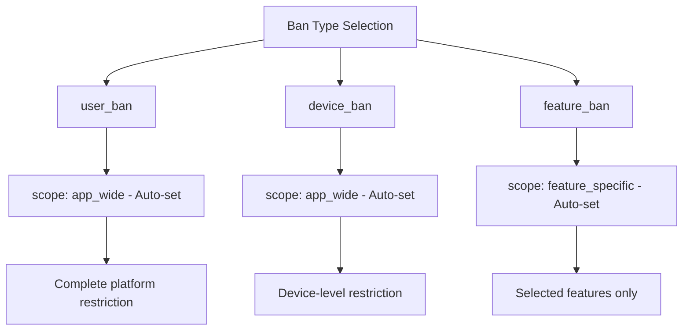
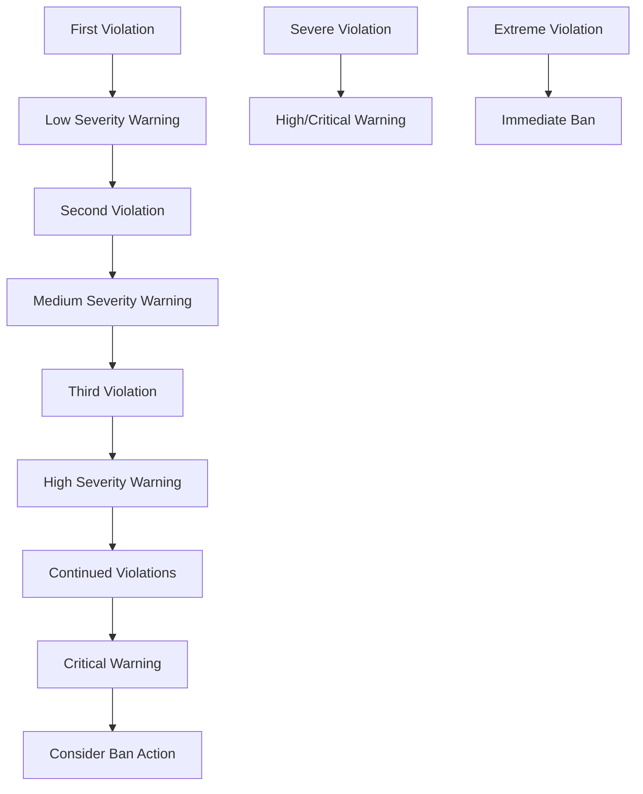
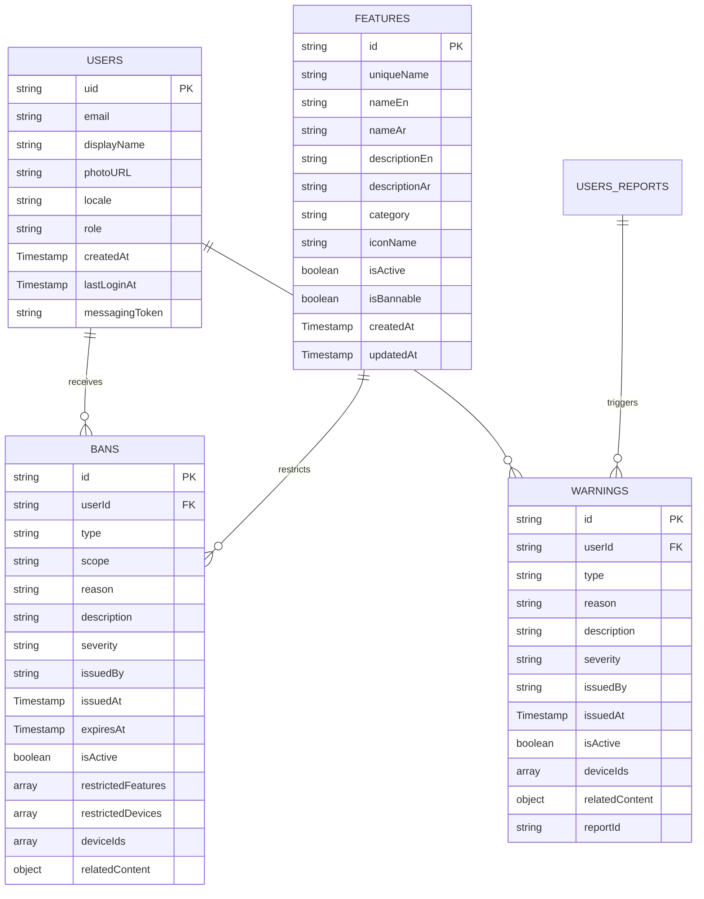

# Ban & Warning System Document Structure

This document provides a comprehensive overview of the ban and warning system's Firestore database structure, including all collections, subcollections, and their field definitions.

## Collections Overview

The ban and warning system consists of four main collections:

1. **`bans`** - User bans and restrictions
2. **`warnings`** - User warnings and violations
3. **`features`** - App features that can be banned
4. **`users`** - User profiles (referenced by bans and warnings)

---

## 1. `bans` Collection

The main collection that stores all user bans and restrictions.

### Document Structure

```typescript
interface Ban {
  id?: string;                   // Document ID (auto-generated)
  userId: string;                // User ID who is banned
  type: BanType;                 // Type of ban applied
  scope: BanScope;               // Scope of the ban restriction
  reason: string;                // Reason for the ban
  description?: string;          // Additional details about the ban
  severity: BanSeverity;         // Duration type of the ban
  issuedBy: string;              // Admin UID who issued the ban
  issuedAt: Timestamp;           // When the ban was issued
  expiresAt?: Timestamp | null;  // When the ban expires (null for permanent)
  isActive: boolean;             // Whether the ban is currently active
  restrictedFeatures?: string[]; // Feature unique names (for feature bans)
  restrictedDevices?: string[];  // Device IDs (for device bans)
  deviceIds?: string[];          // User's device IDs at time of ban
  relatedContent?: RelatedContent; // Reference to related content
}

type BanType = 
  | 'user_ban'                   // Complete user account ban
  | 'device_ban'                 // Specific device ban
  | 'feature_ban';               // Specific feature restriction

type BanScope = 
  | 'app_wide'                   // Entire application ban
  | 'feature_specific';          // Specific features only

type BanSeverity = 
  | 'temporary'                  // Has expiration date/time
  | 'permanent';                 // Never expires

interface RelatedContent {
  type: 'user' | 'report' | 'post' | 'comment' | 'message' | 'group' | 'other';
  id: string;                    // ID of the related content
  title?: string;                // Optional title/description
  metadata?: { [key: string]: any }; // Additional context
}
```

### Field Descriptions

| Field | Type | Required | Description |
|-------|------|----------|-------------|
| `id` | string | Yes | Auto-generated document ID, used as unique identifier |
| `userId` | string | Yes | Firebase Authentication user ID who is being banned |
| `type` | string | Yes | Type of ban: 'user_ban', 'device_ban', or 'feature_ban' |
| `scope` | string | Yes | Restriction scope (auto-set based on ban type) |
| `reason` | string | Yes | The primary reason for issuing this ban |
| `description` | string | No | Additional details or context about the ban |
| `severity` | string | Yes | 'temporary' (with expiration) or 'permanent' |
| `issuedBy` | string | Yes | UID of the admin who issued the ban |
| `issuedAt` | Timestamp | Yes | When the ban was created |
| `expiresAt` | Timestamp | No | Expiration time (null for permanent bans) |
| `isActive` | boolean | Yes | Current status of the ban |
| `restrictedFeatures` | string[] | No | Array of feature uniqueNames (for feature bans only) |
| `restrictedDevices` | string[] | No | Array of device IDs (for device bans only) |
| `deviceIds` | string[] | No | User's device IDs captured at ban time (for tracking) |
| `relatedContent` | object | No | Reference to content that triggered the ban |

### Ban Type Logic



**Ban Type Rules:**
- **User Ban**: Always `app_wide` scope (cannot be changed)
- **Device Ban**: Always `app_wide` scope (cannot be changed)
- **Feature Ban**: Always `feature_specific` scope (cannot be changed)
- **Scope Selection**: Automatically determined by ban type

### Expiration Logic

```typescript
const isBanExpired = (ban: Ban): boolean => {
  if (!ban.expiresAt) return false; // Permanent bans never expire
  return new Date() > ban.expiresAt.toDate();
};

const isActiveBan = (ban: Ban): boolean => {
  return ban.isActive && !isBanExpired(ban);
};
```

---

## 2. `warnings` Collection

Stores user warnings and policy violations.

### Document Structure

```typescript
interface Warning {
  id?: string;                   // Document ID (auto-generated)
  userId: string;                // User ID who received the warning
  type: WarningType;             // Category of the warning
  reason: string;                // Reason for the warning
  description?: string;          // Additional details about the warning
  severity: WarningSeverity;     // Severity level of the warning
  issuedBy: string;              // Admin UID who issued the warning
  issuedAt: Timestamp;           // When the warning was issued
  isActive: boolean;             // Whether the warning is currently active
  deviceIds?: string[];          // User's device IDs at warning time
  relatedContent?: RelatedContent; // Reference to related content
  reportId?: string;             // Link to user report if applicable
}

type WarningType = 
  | 'content_violation'          // Content policy violations
  | 'inappropriate_behavior'     // Behavioral issues
  | 'spam'                       // Spam or excessive posting
  | 'harassment'                 // Harassment or bullying
  | 'other';                     // Other violations

type WarningSeverity = 
  | 'low'                        // Minor violations
  | 'medium'                     // Moderate violations
  | 'high'                       // Serious violations
  | 'critical';                  // Severe violations requiring attention
```

### Field Descriptions

| Field | Type | Required | Description |
|-------|------|----------|-------------|
| `userId` | string | Yes | Firebase Authentication user ID receiving the warning |
| `type` | string | Yes | Category of violation that triggered the warning |
| `reason` | string | Yes | The primary reason for issuing this warning |
| `description` | string | No | Additional details or context about the warning |
| `severity` | string | Yes | Severity level indicating how serious the violation is |
| `issuedBy` | string | Yes | UID of the admin who issued the warning |
| `issuedAt` | Timestamp | Yes | When the warning was created |
| `isActive` | boolean | Yes | Current status of the warning |
| `deviceIds` | string[] | No | User's device IDs captured at warning time |
| `relatedContent` | object | No | Reference to content that triggered the warning |
| `reportId` | string | No | Link to user report if warning relates to a report |

### Warning Escalation Flow



---

## 3. `features` Collection

Defines app features that can be restricted through feature bans.

### Document Structure

```typescript
interface AppFeature {
  id?: string;                   // Document ID (auto-generated)
  uniqueName: string;            // Unique identifier for the feature
  nameEn: string;                // English name of the feature
  nameAr: string;                // Arabic name of the feature
  descriptionEn: string;         // English description
  descriptionAr: string;         // Arabic description
  category: FeatureCategory;     // Feature category
  iconName: string;              // Icon identifier (Lucide React icon)
  isActive: boolean;             // Whether feature is currently available
  isBannable: boolean;           // Whether this feature can be banned
  createdAt: Timestamp;          // When feature was created
  updatedAt: Timestamp;          // Last modification time
}

type FeatureCategory = 
  | 'core'                       // Essential app functionality
  | 'social'                     // Social interaction features
  | 'content'                    // Content creation/management
  | 'communication'              // Messaging and communication
  | 'settings';                  // User settings and preferences
```

### Field Descriptions

| Field | Type | Required | Description |
|-------|------|----------|-------------|
| `uniqueName` | string | Yes | Unique identifier generated from English name (snake_case) |
| `nameEn` | string | Yes | Display name in English |
| `nameAr` | string | Yes | Display name in Arabic |
| `descriptionEn` | string | Yes | Detailed description in English |
| `descriptionAr` | string | Yes | Detailed description in Arabic |
| `category` | string | Yes | Feature category for organization |
| `iconName` | string | Yes | Lucide React icon name (e.g., 'MessageSquare', 'Users') |
| `isActive` | boolean | Yes | Controls feature availability in the app |
| `isBannable` | boolean | Yes | Controls whether this feature can be restricted |
| `createdAt` | Timestamp | Yes | Audit field for creation time |
| `updatedAt` | Timestamp | Yes | Audit field for last modification |

### Feature Categories

| Category | Purpose | Examples |
|----------|---------|----------|
| `core` | Essential app functionality | Login, Profile management, Core navigation |
| `social` | Social interaction features | Friend requests, Following, Social feeds |
| `content` | Content creation/management | Post creation, Content upload, Editing |
| `communication` | Messaging and communication | Direct messaging, Group chat, Comments |
| `settings` | User settings and preferences | Privacy settings, Notifications, Themes |

### Sample Feature Documents

```json
{
  "uniqueName": "direct_messaging",
  "nameEn": "Direct Messaging",
  "nameAr": "الرسائل المباشرة",
  "descriptionEn": "Send private messages to other users",
  "descriptionAr": "إرسال رسائل خاصة للمستخدمين الآخرين",
  "category": "communication",
  "iconName": "MessageSquare",
  "isActive": true,
  "isBannable": true,
  "createdAt": "2024-01-01T00:00:00Z",
  "updatedAt": "2024-01-01T00:00:00Z"
}
```

---

## 4. `users` Collection

User profile information referenced by bans and warnings.

### Document Structure

```typescript
interface UserProfile {
  uid: string;                   // Document ID (matches Auth UID)
  email: string;                 // User's email address
  displayName?: string;          // User's display name (optional)
  photoURL?: string;             // Profile picture URL (optional)
  locale?: string;               // User's language preference
  createdAt: Timestamp;          // Account creation time
  lastLoginAt?: Timestamp;       // Last login timestamp (optional)
  messagingToken?: string;       // FCM token for push notifications (optional)
  role?: string;                 // User role (admin, moderator, user)
}
```

### Field Descriptions

| Field | Type | Required | Description |
|-------|------|----------|-------------|
| `uid` | string | Yes | Firebase Authentication user ID (document ID) |
| `email` | string | Yes | User's email address from Firebase Auth |
| `displayName` | string | No | User's display name |
| `photoURL` | string | No | URL to user's profile picture |
| `locale` | string | No | Language preference ('en', 'ar', 'arabic') |
| `createdAt` | Timestamp | Yes | When the user account was created |
| `lastLoginAt` | Timestamp | No | Last successful login time |
| `messagingToken` | string | No | Firebase Cloud Messaging token for notifications |
| `role` | string | No | User's role (admin, moderator, user) |

---

## Relationships and Data Flow

### Entity Relationship Diagram



### Data Access Patterns

1. **Get user bans**: Query `bans` where `userId == 'user123'` and `isActive == true`
2. **Get user warnings**: Query `warnings` where `userId == 'user123'` and `isActive == true`
3. **Check feature ban**: Query `bans` where feature in `restrictedFeatures` array
4. **Device history**: Query `bans`/`warnings` where `deviceIds` array contains device ID
5. **Get bannable features**: Query `features` where `isBannable == true` and `isActive == true`

### Device Tracking System

The system tracks device IDs to prevent ban evasion:

```typescript
// Device history check
const checkDeviceHistory = async (deviceIds: string[]) => {
  // Query bans with matching device IDs (Firestore limit: 10 items)
  const bansQuery = query(
    collection(db, 'bans'),
    where('deviceIds', 'array-contains-any', deviceIds.slice(0, 10))
  );
  
  // Query warnings with matching device IDs
  const warningsQuery = query(
    collection(db, 'warnings'),
    where('deviceIds', 'array-contains-any', deviceIds.slice(0, 10))
  );
  
  // Process results to identify potential ban evasion
};
```

### Indexes Required

For optimal performance, ensure these Firestore indexes:

```
Collection: bans
- userId (ASC), isActive (ASC), issuedAt (DESC)
- type (ASC), isActive (ASC)
- deviceIds (ARRAY)

Collection: warnings
- userId (ASC), isActive (ASC), issuedAt (DESC)
- type (ASC), severity (ASC)
- deviceIds (ARRAY)

Collection: features
- isActive (ASC), isBannable (ASC), category (ASC)
- category (ASC), nameEn (ASC)
- uniqueName (ASC)
```

---

## Business Logic & Constraints

### Ban Enforcement Rules

1. **User Ban**: Blocks all app access for the user
2. **Device Ban**: Blocks all app access from specific devices
3. **Feature Ban**: Blocks access to selected features only
4. **Temporary bans**: Automatically expire at specified time
5. **Permanent bans**: Never expire unless manually revoked

### Validation Rules

```typescript
// Ban validation
if (!reason.trim()) throw new Error('Reason is required');

if (type === 'feature_ban' && (!restrictedFeatures || restrictedFeatures.length === 0)) {
  throw new Error('At least one feature must be selected for feature bans');
}

if (severity === 'temporary' && !expiresAt) {
  throw new Error('Expiration date/time required for temporary bans');
}

// Warning validation
if (!reason.trim()) throw new Error('Reason is required');
```

### Access Control Logic

```typescript
// Check if user can access a feature
const canUserAccessFeature = async (userId: string, featureUniqueName: string): Promise<boolean> => {
  // Check for active user bans (app-wide)
  const userBans = await getUserBans(userId);
  const hasAppWideBan = userBans.some(ban => ban.scope === 'app_wide' && isActiveBan(ban));
  if (hasAppWideBan) return false;
  
  // Check for feature-specific bans
  const hasFeatureBan = userBans.some(ban => 
    ban.scope === 'feature_specific' && 
    ban.restrictedFeatures?.includes(featureUniqueName) &&
    isActiveBan(ban)
  );
  if (hasFeatureBan) return false;
  
  return true;
};
```

---

## Security Rules

The system implements Firestore security rules to protect sensitive data:

### Example Security Rules

```javascript
rules_version = '2';
service cloud.firestore {
  match /databases/{database}/documents {
    // Helper function to check if user is admin
    function isAdmin() {
      return request.auth != null && 
             get(/databases/$(database)/documents/users/$(request.auth.uid)).data.role == 'admin';
    }
    
    // Bans collection - admin only for write, users can read their own
    match /bans/{banId} {
      allow read: if request.auth != null && 
                     (resource.data.userId == request.auth.uid || isAdmin());
      allow write: if isAdmin();
    }
    
    // Warnings collection - admin only for write, users can read their own
    match /warnings/{warningId} {
      allow read: if request.auth != null && 
                     (resource.data.userId == request.auth.uid || isAdmin());
      allow write: if isAdmin();
    }
    
    // Features collection - read for authenticated users, write for admins
    match /features/{featureId} {
      allow read: if request.auth != null;
      allow write: if isAdmin();
    }
    
    // Users collection - users can read/update their own profile
    match /users/{userId} {
      allow read: if request.auth != null && 
                     (request.auth.uid == userId || isAdmin());
      allow write: if request.auth != null && request.auth.uid == userId;
      allow create: if request.auth != null && request.auth.uid == userId;
    }
  }
}
```

---

## Integration with Reports System

The ban/warning system integrates with the reports system:

1. **Warning from Report**: Warnings can reference `reportId` for traceability
2. **Ban from Report**: Bans can include report information in `relatedContent`
3. **Escalation Path**: Reports → Warnings → Bans
4. **Admin Workflow**: View report → Issue warning/ban → Update report status

---

## Notification System

The system sends notifications for ban/warning events:

### Warning Notifications
- **User**: Notified when receiving a warning
- **Content**: Warning details and violation information
- **Action**: User can view warning in their profile

### Ban Notifications
- **User**: Notified when banned (if not app-wide ban)
- **Content**: Ban details, duration, and restrictions
- **Action**: User understands limitations

### Admin Notifications
- **Device History Alerts**: When issuing bans/warnings on devices with previous violations
- **Escalation Alerts**: When user accumulates multiple warnings

---

This document structure supports a comprehensive user moderation system with device tracking, escalation policies, feature-level restrictions, and proper audit trails for administrative oversight. 