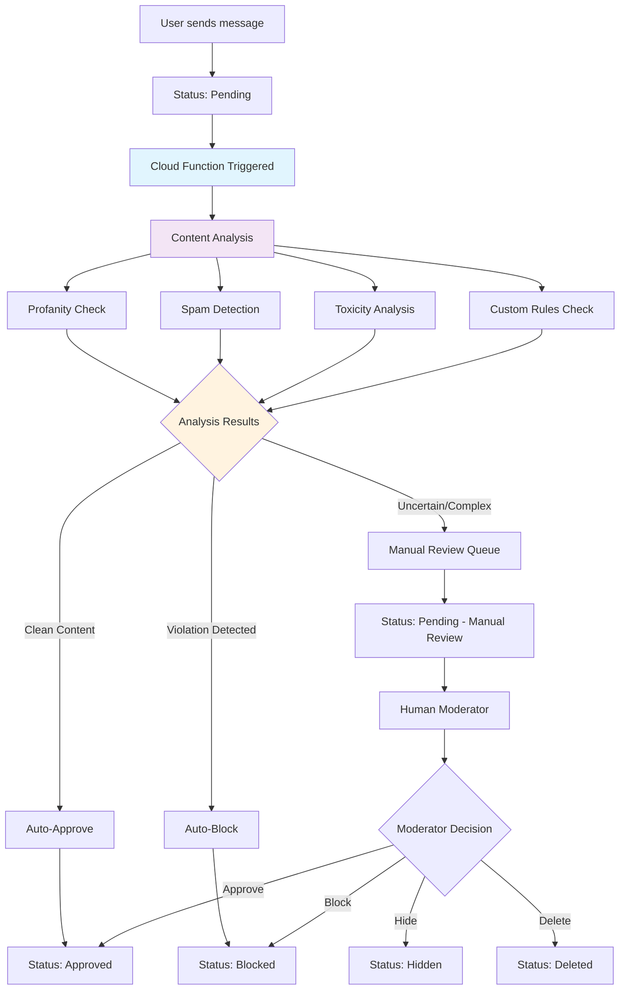

# Message Status User Experience Guide

This document outlines how different message moderation statuses are reflected in the user-facing application.

## Status Types Overview

The system uses multiple status indicators to manage message visibility and user experience:

| Status | Property | User Visibility | Admin Visibility |
|--------|----------|----------------|------------------|
| Pending | `moderation.status: 'pending'` | Hidden/Limited | Visible with indicator |
| Approved | `moderation.status: 'approved'` | Fully visible | Visible |
| Blocked | `moderation.status: 'blocked'` | Hidden | Visible with indicator |
| Deleted | `isDeleted: true` | Shows deletion message | Visible with indicator |
| Hidden | `isHidden: true` | Not visible | Visible with indicator |
| Reported | Has related reports | Normal visibility* | Flagged indicator |

*Reported messages remain visible unless also blocked/hidden/deleted

## Detailed User Experience

### 1. Pending Messages (`moderation.status: 'pending'`)

**Automatic Moderation Flow:**
- Message is automatically set to `pending` upon creation
- Cloud function triggers immediately for content analysis
- Function performs automated checks (profanity, spam, toxicity, etc.)
- Status auto-updates based on cloud function results (typically within 1-3 seconds)

**User App Behavior:**
- **Sender View**: Message appears with "⏳ Checking..." indicator initially
- **Real-time Update**: Status changes to approved/blocked automatically via websocket
- **Other Users**: Message not visible until approved
- **Message Bubble**: Shown with reduced opacity and animated pending icon
- **Interactions**: No replies, reactions, or sharing allowed during pending state

**UI Example (Initial State):**
```
[👤 User] ⏳ Checking...
Your message is being reviewed...
```

**UI Example (After Cloud Function - Approved):**
```
[👤 User] ✅
Your message content here
[❤️ React] [💬 Reply] [📤 Share]
```

**UI Example (After Cloud Function - Blocked):**
```
[👤 User] 🚫 Blocked
Your message violated community guidelines
Reason: Inappropriate content detected
```

---

### 2. Approved Messages (`moderation.status: 'approved'`)

**User App Behavior:**
- **All Users**: Full visibility and functionality
- **Message Bubble**: Normal appearance
- **Interactions**: All features available (reply, react, share, etc.)

**UI Example:**
```
[👤 User] ✅
This is an approved message that everyone can see
[❤️ 5] [💬 Reply] [📤 Share]
```

---

### 3. Blocked Messages (`moderation.status: 'blocked'`)

**User App Behavior:**
- **Sender View**: "🚫 Message blocked by moderator"
- **Other Users**: Message not visible
- **Reason Display**: If provided, shows moderation reason to sender
- **Interactions**: None available

**UI Example:**
```
[👤 User] 🚫 Blocked
Your message violated community guidelines
Reason: Inappropriate content
```

---

### 4. Deleted Messages (`isDeleted: true`)

**User App Behavior:**
- **All Users**: Shows deletion placeholder
- **Message Content**: Replaced with deletion notice
- **Timestamp**: Preserved
- **Thread Context**: Maintains conversation flow

**UI Example:**
```
[👤 User] 🗑️
This message was deleted
[2:45 PM]
```

---

### 5. Hidden Messages (`isHidden: true`)

**User App Behavior:**
- **Regular Users**: Message completely invisible
- **Message Thread**: No gap or placeholder shown
- **Search Results**: Excluded from search
- **Notifications**: No notifications sent

**Admin View:**
```
[👤 User] 👁️‍🗨️ Hidden
This message is hidden from users
[Show/Unhide] [Delete Permanently]
```

---

### 6. Reported Messages (Has Reports)

**User App Behavior:**
- **Regular Users**: Normal visibility (unless also moderated)
- **Reporting User**: May show "You reported this message" indicator
- **Message Appearance**: Standard, no visual changes

**Admin Indicators:**
```
[👤 User] 🚨 3 reports
This is a reported message
[View Reports] [Moderate] [Dismiss Reports]
```

## Status Priority & Combinations

When multiple statuses apply, the system follows this priority order:

1. **Deleted** (`isDeleted: true`) - Always takes precedence
2. **Hidden** (`isHidden: true`) - Makes message invisible to users
3. **Blocked** (`moderation.status: 'blocked'`) - Shows block message to sender
4. **Pending** (`moderation.status: 'pending'`) - Limited visibility
5. **Approved** + **Reported** - Normal visibility with admin flags

### Example Combinations:

**Blocked + Hidden:**
- Users: Message not visible
- Sender: Shows "Message blocked" notice
- Admins: Can see both statuses

**Deleted + Reported:**
- Users: Shows "This message was deleted"
- Reports: Remain visible to admins for record-keeping

## User Interaction Limitations

### Actions Disabled by Status:

| Action | Pending | Blocked | Hidden | Deleted |
|--------|---------|---------|---------|---------|
| Reply | ❌ | ❌ | ❌ | ❌ |
| React | ❌ | ❌ | ❌ | ❌ |
| Share | ❌ | ❌ | ❌ | ❌ |
| Edit | ❌ | ❌ | ❌ | ❌ |
| Report | ❌ | ❌ | ❌ | ❌ |
| Copy Text | ❌ | ❌ | ❌ | ❌ |

### Special Cases:

**Message Threading:**
- Deleted messages maintain thread structure
- Hidden messages are completely removed from threads
- Blocked messages show in sender's thread only

**Push Notifications:**
- Pending: No notifications sent to recipients
- Blocked/Hidden: No notifications
- Deleted: Existing notifications may be withdrawn

## Mobile App Implementation Notes

### iOS/Android Considerations:

1. **Offline Sync**: Moderated messages sync status when app comes online
2. **Cache Management**: Blocked/hidden messages removed from local cache
3. **Real-time Updates**: Status changes reflected immediately via websockets
4. **Accessibility**: Screen readers announce status changes appropriately

### Animation & Transitions:

- **Status Changes**: Smooth transitions when status updates
- **Deletion Animation**: Fade out with slide animation
- **Pending Indicator**: Subtle pulse animation
- **Error States**: Clear error messaging for failed actions

## Moderation Workflow Impact

### Automated Moderation Flow:



### Cloud Function Processing Details:

**Function Execution:**
- **Trigger**: Firestore onCreate for new messages
- **Timeout**: 10 seconds maximum
- **Processing Time**: Usually 1-3 seconds
- **Retry Policy**: 3 attempts on failure
- **Fallback**: Manual review queue if function fails

**Analysis Performed:**
1. **Content Filtering**: Profanity, hate speech, explicit content
2. **Spam Detection**: Repetitive content, promotional links
3. **Toxicity Scoring**: AI-powered toxicity analysis
4. **Custom Rules**: Group-specific or platform-specific rules
5. **Rate Limiting**: User messaging frequency checks
6. **Link Validation**: Suspicious or malicious URL detection

### Notification Strategy:

1. **Auto-Moderation Notifications** (to sender):
   - ✅ Auto-Approved: No notification (seamless experience)
   - 🚫 Auto-Blocked: Push notification with reason
   - ⏳ Manual Review: "Your message is under review by moderators"

2. **Manual Moderation Notifications** (to sender):
   - ✅ Approved: "Your message has been approved"
   - 🚫 Blocked: "Your message was blocked: [reason]"
   - 🗑️ Deleted: "Your message was removed: [reason]"
   - 👁️‍🗨️ Hidden: No notification (silent action)

3. **Group Notifications**:
   - Only approved messages generate notifications to other members
   - Auto-approved messages notify immediately after cloud function approval
   - Manually approved messages notify after human moderator approval

## Best Practices for Implementation

### 1. User Communication:
- Always explain why a message was moderated
- Provide clear next steps for users
- Link to community guidelines when relevant

### 2. Performance Considerations:
- Cache status checks to avoid repeated API calls
- Implement efficient filtering for hidden/blocked content
- Use incremental loading for large conversation histories
- Optimize cloud function cold starts for faster processing
- Implement websocket connections for real-time status updates
- Use batch processing for multiple messages when possible

### 3. Privacy & Security:
- Don't expose moderation reasons to non-relevant users
- Log all status changes for audit purposes
- Respect user privacy in deletion processes

### 4. Accessibility:
- Provide screen reader friendly status descriptions
- Use semantic HTML for status indicators
- Ensure sufficient color contrast for status indicators

---

## Cloud Function Implementation

### Function Configuration:

```javascript
// Cloud Function Trigger
exports.moderateMessage = functions.firestore
  .document('group_messages/{messageId}')
  .onCreate(async (snap, context) => {
    const message = snap.data();
    const messageId = context.params.messageId;
    
    // Perform moderation checks
    const moderationResult = await performContentAnalysis(message.body);
    
    // Update message status based on result
    await snap.ref.update({
      moderation: {
        status: moderationResult.approved ? 'approved' : 'blocked',
        reason: moderationResult.reason,
        moderatedBy: 'auto-moderator',
        moderatedAt: admin.firestore.FieldValue.serverTimestamp(),
        confidence: moderationResult.confidence
      },
      isHidden: moderationResult.shouldHide,
      autoModerated: true
    });
    
    // Send notifications if needed
    if (!moderationResult.approved) {
      await sendModerationNotification(message.senderCpId, moderationResult);
    }
  });
```

### Real-time Updates:

**Client-Side Listeners:**
```javascript
// Listen for message status changes
const unsubscribe = onSnapshot(
  doc(db, 'group_messages', messageId),
  (doc) => {
    const message = doc.data();
    if (message.moderation.status !== 'pending') {
      updateUIWithNewStatus(message);
    }
  }
);
```

**Expected Processing Times:**
- **Auto-Approval**: 1-2 seconds
- **Auto-Block**: 1-3 seconds  
- **Manual Review Queue**: 2-5 seconds (to queue)
- **Function Timeout**: 10 seconds maximum

### Fallback Mechanisms:

1. **Cloud Function Failure**: Message stays pending, queued for manual review
2. **Network Issues**: Status updates via periodic sync when connection restored
3. **High Load**: Function scales automatically, may experience slight delays
4. **API Limits**: Graceful degradation to manual review queue

---

## Technical Implementation References

- **Admin Panel**: Messages can be bulk-moderated via the admin content page
- **Cloud Functions**: Automated content moderation on message creation
- **API Endpoints**: Status changes trigger real-time updates via websockets  
- **Database Schema**: Message documents contain all status fields and moderation metadata
- **Firestore Rules**: Enforce status-based visibility permissions
- **Real-time Sync**: WebSocket connections for instant status updates
- **Monitoring**: Cloud function logs and performance metrics for moderation pipeline
