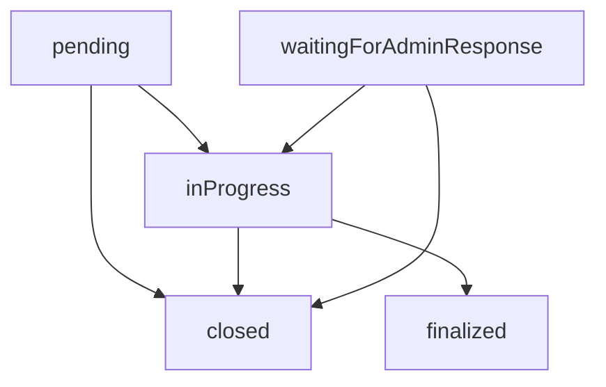
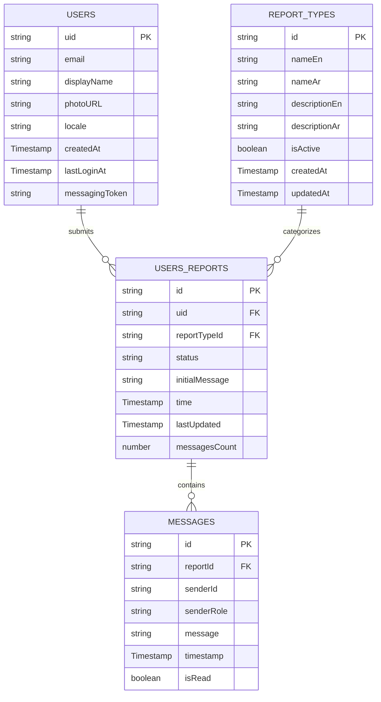

# Reports System Document Structure

This document provides a comprehensive overview of the report system's Firestore database structure, including all collections, subcollections, and their field definitions.

## Collections Overview

The reports system consists of three main collections and one subcollection:

1. **`usersReports`** - Main reports collection
2. **`reportTypes`** - Report categories/types
3. **`users`** - User profiles (referenced by reports)
4. **`usersReports/{reportId}/messages`** - Conversation messages (subcollection)

---

## 1. `usersReports` Collection

The main collection that stores all user reports.

### Document Structure

```typescript
interface UserReport {
  id: string;                    // Document ID (auto-generated)
  uid: string;                   // User ID who submitted the report
  time: Timestamp;               // When the report was created
  reportTypeId: string;          // Reference to reportTypes collection
  status: ReportStatus;          // Current status of the report
  initialMessage: string;        // Initial message/complaint from user
  lastUpdated: Timestamp;        // Last time the report was modified
  messagesCount: number;         // Total number of messages in conversation
}

type ReportStatus = 
  | 'pending'                    // New report, not yet reviewed
  | 'inProgress'                 // Admin is working on the report
  | 'waitingForAdminResponse'    // Waiting for admin to respond
  | 'closed'                     // Report resolved and closed
  | 'finalized';                 // Report permanently closed
```

### Field Descriptions

| Field | Type | Required | Description |
|-------|------|----------|-------------|
| `id` | string | Yes | Auto-generated document ID, used as unique identifier |
| `uid` | string | Yes | Firebase Authentication user ID who submitted the report |
| `time` | Timestamp | Yes | Creation timestamp of the report |
| `reportTypeId` | string | Yes | Foreign key reference to `reportTypes` collection |
| `status` | string | Yes | Current workflow status (see status flow below) |
| `initialMessage` | string | Yes | The user's initial complaint/report message |
| `lastUpdated` | Timestamp | Yes | Timestamp of last modification (status change or new message) |
| `messagesCount` | number | Yes | Cache field for number of messages in the conversation |

### Status Flow



**Status Transitions:**
- `pending` → `inProgress` (Admin starts reviewing)
- `pending` → `closed` (Quick resolution without review)
- `inProgress` → `closed` (Report resolved)
- `inProgress` → `finalized` (Report permanently closed)
- `waitingForAdminResponse` → `inProgress` (Admin responds)
- `waitingForAdminResponse` → `closed` (Report closed)

### Legacy Fields

Some documents may contain legacy fields from earlier versions:
- `reportType` - Old field name for `reportTypeId`
- `userJustification` - Old field name for `initialMessage`

---

## 2. `reportTypes` Collection

Defines categories and types of reports that users can submit.

### Document Structure

```typescript
interface ReportType {
  id?: string;                   // Document ID (auto-generated)
  nameEn: string;                // English name of the report type
  nameAr: string;                // Arabic name of the report type
  descriptionEn: string;         // English description
  descriptionAr: string;         // Arabic description
  isActive: boolean;             // Whether this type is available for selection
  createdAt?: Timestamp;         // When this report type was created
  updatedAt?: Timestamp;         // Last modification time
}
```

### Field Descriptions

| Field | Type | Required | Description |
|-------|------|----------|-------------|
| `nameEn` | string | Yes | Display name in English for the report type |
| `nameAr` | string | Yes | Display name in Arabic for the report type |
| `descriptionEn` | string | Yes | Detailed description in English |
| `descriptionAr` | string | Yes | Detailed description in Arabic |
| `isActive` | boolean | Yes | Controls visibility in user interfaces |
| `createdAt` | Timestamp | No | Audit field for creation time |
| `updatedAt` | Timestamp | No | Audit field for last modification |

### Usage

Report types are referenced by `usersReports.reportTypeId`. The appropriate language version (`nameEn`/`nameAr`, `descriptionEn`/`descriptionAr`) is displayed based on user locale.

---

## 3. `users` Collection

User profile information referenced by reports.

### Document Structure

```typescript
interface UserProfile {
  uid: string;                   // Document ID (matches Auth UID)
  email: string;                 // User's email address
  displayName?: string;          // User's display name (optional)
  photoURL?: string;             // Profile picture URL (optional)
  locale?: string;               // User's language preference
  createdAt: Timestamp;          // Account creation time
  lastLoginAt?: Timestamp;       // Last login timestamp (optional)
  messagingToken?: string;       // FCM token for push notifications (optional)
}
```

### Field Descriptions

| Field | Type | Required | Description |
|-------|------|----------|-------------|
| `uid` | string | Yes | Firebase Authentication user ID (document ID) |
| `email` | string | Yes | User's email address from Firebase Auth |
| `displayName` | string | No | User's display name |
| `photoURL` | string | No | URL to user's profile picture |
| `locale` | string | No | Language preference ('en', 'ar', 'arabic') |
| `createdAt` | Timestamp | Yes | When the user account was created |
| `lastLoginAt` | Timestamp | No | Last successful login time |
| `messagingToken` | string | No | Firebase Cloud Messaging token for notifications |

---

## 4. `usersReports/{reportId}/messages` Subcollection

Stores the conversation between users and admins for each report.

### Document Structure

```typescript
interface ReportMessage {
  id: string;                    // Document ID (auto-generated)
  reportId: string;              // Parent report ID (redundant but useful)
  senderId: string;              // ID of who sent the message
  senderRole: 'user' | 'admin';  // Role of the message sender
  message: string;               // Message content
  timestamp: Timestamp;          // When the message was sent
  isRead: boolean;               // Whether the message has been read
}
```

### Field Descriptions

| Field | Type | Required | Description |
|-------|------|----------|-------------|
| `reportId` | string | Yes | Reference to parent report document |
| `senderId` | string | Yes | User ID or 'admin' identifier |
| `senderRole` | string | Yes | Either 'user' (original reporter) or 'admin' |
| `message` | string | Yes | The message content |
| `timestamp` | Timestamp | Yes | When the message was sent |
| `isRead` | boolean | Yes | Read status (used for UI indicators) |

### Message Flow

1. User submits initial report → Creates `usersReports` document with `initialMessage`
2. Admin responds → Adds message to subcollection with `senderRole: 'admin'`
3. User replies → Adds message to subcollection with `senderRole: 'user'`
4. Each new message updates parent report's `lastUpdated` and `messagesCount`

---

## Relationships and Data Flow

### Entity Relationship Diagram



### Data Access Patterns

1. **List all reports**: Query `usersReports` with pagination
2. **Filter by status**: Query `usersReports` where `status == 'pending'`
3. **Get user reports**: Query `usersReports` where `uid == 'user123'`
4. **Load conversation**: Query `usersReports/{reportId}/messages` ordered by `timestamp`
5. **Get report types**: Query `reportTypes` where `isActive == true`

### Indexes Required

For optimal performance, ensure these Firestore indexes:

```
Collection: usersReports
- status (ASC), time (DESC)
- uid (ASC), time (DESC)
- time (DESC)

Collection: usersReports/{reportId}/messages
- timestamp (ASC)

Collection: reportTypes
- isActive (ASC), updatedAt (DESC)
- updatedAt (DESC)
```

---

## Business Logic & Constraints

### Report Lifecycle

1. **Creation**: User submits report with `initialMessage` and `reportTypeId`
2. **Assignment**: Admin changes status to `inProgress`
3. **Communication**: Messages exchanged via subcollection
4. **Resolution**: Status changed to `closed` or `finalized`

### Validation Rules

1. `reportTypeId` must exist in `reportTypes` collection
2. `uid` must exist in `users` collection
3. Only valid status transitions are allowed
4. `messagesCount` must match actual message count
5. Only admins can change report status
6. Users can only message on non-closed reports

### Notification System

- New reports trigger admin notifications
- Admin messages trigger user push notifications
- Status changes send notifications to users
- Uses FCM tokens from `users.messagingToken`

---

## Security Rules

The system implements Firestore security rules to:

1. Users can only read their own reports
2. Users can only create new reports (not modify existing)
3. Users can read/write messages in their own report conversations
4. Admins have full read/write access
5. Report types are read-only for users
6. User profiles protect sensitive fields


