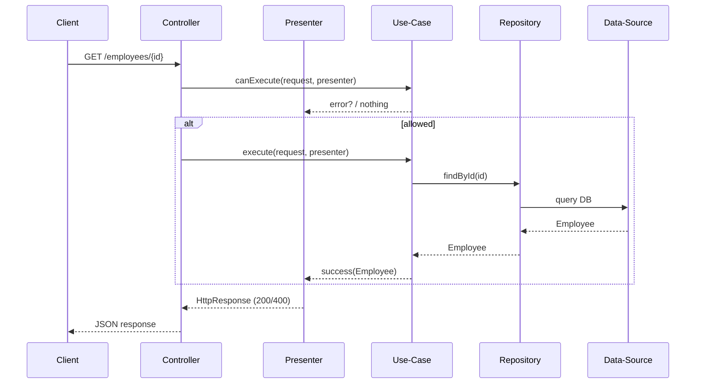

# Clean Architecture – Use-Case Slice (Dart edition)
_A Dart/Flutter-oriented rewrite of the Presenter-based slice you shared in C#_

```mermaid
graph TD
  subgraph Domain
    Entity[Entity] -->|input| UC[Use-Case]
    UC -->|output-port| Presenter
  end
  subgraph Application (HTTP/UI etc.)
    Presenter --> Controller
    Controller -->|Rest JSON| Client
  end
  UC -->|depends on| Repo[(Repository abstraction)]
  Repo -->|impl.| RepoImpl[(Repository implementation)]
  RepoImpl --> Data[Data Source]
```

---

## 1. Domain Layer – Entities
```dart
class Employee {
  final String id;
  final String name;
  // more fields
  const Employee({required this.id, required this.name});
}
```

---

## 2. Domain Layer – Use-Case Contract
Ported 1-for-1 from your C# example:
```dart
abstract class UseCase<TRequest, TResponse> {
  Future<void> execute(TRequest request, Presenter<TResponse> presenter);
  Future<bool> canExecute(TRequest request, Presenter<TResponse> presenter);
}

class EmptyRequest {
  const EmptyRequest();
  static const instance = EmptyRequest();
}

class EmptyResponse {
  const EmptyResponse();
  static const instance = EmptyResponse();
}
```

---

## 3. Presenter (Output-Port)
```dart
abstract class Presenter<TResponse> {
  void success(TResponse response);
  void error(String message);
}
```

### 3.1 REST-specific Presenter
```dart
class RestPresenter<T> implements Presenter<T> {
  late HttpResponse _response;

  @override
  void success(T body) {
    _response = HttpResponse.ok(jsonEncode(body));
  }

  @override
  void error(String msg) {
    _response = HttpResponse.badRequest(body: jsonEncode({'error': msg}));
  }

  HttpResponse render() => _response;
}
```

*(Above uses `package:shelf` response objects for brevity; adapt to `dart_frog`, `expressive_router`, etc.)*

---

## 4. Request & Response DTOs (one per use-case)
```dart
class GetEmployeeRequest {
  final String id;
  const GetEmployeeRequest(this.id);
}

class GetEmployeeResponse {
  final Employee employee;
  const GetEmployeeResponse(this.employee);
}
```

---

## 5. Repository Port
```dart
abstract class EmployeeRepository {
  Future<Employee?> findById(String id);
  Future<bool> isActive(String id);
}
```

---

## 6. Use-Case Implementation
```dart
class GetEmployeeUseCase
    implements UseCase<GetEmployeeRequest, GetEmployeeResponse> {
  final EmployeeRepository _repo;
  const GetEmployeeUseCase(this._repo);

  @override
  Future<bool> canExecute(
    GetEmployeeRequest req,
    Presenter<GetEmployeeResponse> presenter,
  ) async {
    final active = await _repo.isActive(req.id);
    if (!active) {
      presenter.error('Employee is not active');
      return false;
    }
    return true;
  }

  @override
  Future<void> execute(
    GetEmployeeRequest req,
    Presenter<GetEmployeeResponse> presenter,
  ) async {
    final employee = await _repo.findById(req.id);
    if (employee == null) {
      presenter.error('Employee not found');
      return;
    }
    presenter.success(GetEmployeeResponse(employee));
  }
}
```

---

## 7. Controller / Handler Example
```dart
class EmployeeController {
  final GetEmployeeUseCase _uc;
  const EmployeeController(this._uc);

  Future<HttpResponse> handle(HttpRequest request, String id) async {
    final presenter = RestPresenter<GetEmployeeResponse>();
    final reqDto = GetEmployeeRequest(id);

    if (await _uc.canExecute(reqDto, presenter)) {
      await _uc.execute(reqDto, presenter);
    }
    return presenter.render();
  }
}
```

---

## 8. Why This Slice?
* **Isolation** – UI/web frameworks interact **only** with presenters, never the domain.
* **Testability** – Use-cases can be unit-tested without HTTP, DB, or Flutter.
* **Consistency** – Same slice pattern scales across REST, GraphQL, gRPC, CLI, or Widgets (create a `WidgetPresenter`).

---

## 9. Full Sequence (Mermaid)


---

> **Tip**: You can still add an FP-style `Either` wrapper *inside* the presenter if you need. The slice pattern above merely dictates the contract shape, not your internal error handling. 